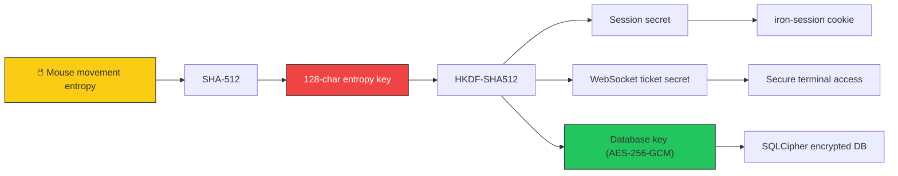
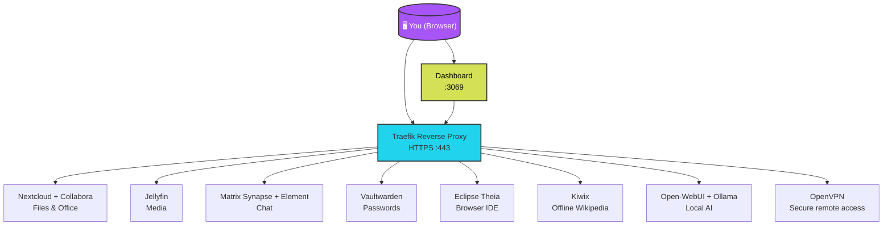
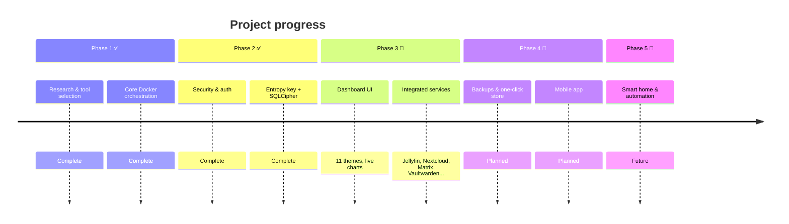

<p align="center">
  
  
  
</p>

<p align="center">
  <h1 align="center">🏠 dhobs</h1>
  <p align="center"><strong>Your personal, private, self-hosted digital hub</strong></p>
  <p align="center">One dashboard · One login · Zero cloud dependency</p>
</p>

<p align="center">
  
</p>

<p align="center">
  <strong>
    <a href="#1-quick-start">Quick Start</a> •
    <a href="#2-integrated-services">Services</a> •
    <a href="#3-security-model">Security</a> •
    <a href="#4-roadmap">Roadmap</a> •
    <a href="https://basilsuhail.github.io/dhobs">Live Preview</a>
  </strong>
</p>

---

## 📋 Table of Contents

1. [Quick Start](#1-quick-start)
2. [Update & Rollback](#2-update--rollback)
3. [First-Time Security Setup](#3-first-time-security-setup)
4. [Integrated Services](#4-integrated-services)
5. [Adding New Services](#5-adding-new-services)
6. [What's Working](#6-whats-working)
7. [What's Not Yet Ready](#7-whats-not-yet-ready)
8. [Security Model](#8-security-model)
9. [Architecture Overview](#9-architecture-overview)
10. [Roadmap](#10-roadmap)
11. [Project Documentation](#11-project-documentation)
12. [Licensing](#12-licensing)
13. [Team & Contributors](#13-team--contributors)

---

## 🎯 The Problem

> Google Drive. Office 365. Netflix. 1Password. Chat apps. AI assistants.
>
> Every service costs monthly fees, harvests your data, and locks you into ecosystems you don't control.

**dhobs replaces all of that** with self-hosted, open-source alternatives running on hardware you own — a Raspberry Pi, an old PC, or a VPS.

**Install once.** Get a private, encrypted, modular platform that runs your digital life.

---

## 🏗️ Core Principles

| Principle | What it means |
|---|---|
| **🎯 Unified** | One login, one dashboard, one update system |
| **🔒 Private** | Encryption keys you control, nothing leaves your network |
| **🧩 Modular** | Install only what you need, add more later |
| **⚡ Simple** | No command line required for day-to-day use |

---

## 1. 🚀 Quick Start

### Option A: The "Boom" Script (Mac / Local)

```bash
chmod +x boom.sh
./boom.sh
```

**What it does:**
- Creates `.env` automatically
- Detects your LAN IP
- Builds and starts all services
- Launches your browser

**Best for:** Day-to-day restarts

### Option B: The "Install" Script (Linux / First-Time Setup)

```bash
chmod +x install.sh
./install.sh
```

**What it does:**
- Creates `.env` automatically
- Detects your LAN IP
- Starts all containers
- Installs Nextcloud Hub apps (Calendar, Contacts, Office, Talk)
- Configures Nextcloud Office (Collabora)

**Best for:** Fresh clones — run once

> ℹ️ Nextcloud Office is auto-configured on every subsequent container start via `config/nextcloud/setup-office.sh`. No manual steps needed after the first install.

### Option C: Manual Docker Setup

```bash
cp .env.example .env
# Open .env and fill in your passwords, then:
docker compose up -d
```

> ⚠️ `boom.sh` and `install.sh` handle `.env` creation automatically. Only use this option if running `docker compose` directly.

---

## 2. 🔄 Update & Rollback

### Pre-Update Check

```bash
bash scripts/pre-update-check.sh
```

### Safe Update (with backup)

```bash
bash scripts/update.sh
```

**Process:**
1. Creates encrypted backup
2. Validates backup integrity
3. Applies updates

### Rollback (if update breaks)

```bash
bash scripts/rollback.sh
```

> 🛡️ The update script automatically aborts if the backup fails. Your current setup is never touched until a valid backup is confirmed.

---

## 3. 🔐 First-Time Security Setup

### Step 1 — Matrix Synapse Secrets

`boom.sh` and `install.sh` auto-generate these on first run.

**Manual setup (Option C only):**

```bash
openssl rand -hex 32   # run three times — one value per variable
```

```env
MATRIX_REGISTRATION_SECRET=<generated>
MATRIX_MACAROON_SECRET_KEY=<generated>
MATRIX_FORM_SECRET=<generated>
```

> ⚠️ These are injected into `config/matrix/homeserver.yaml` at container startup. Never reuse values between installations.

### Step 2 — Dashboard Entropy Key & Admin Account

1. Open `http://localhost:3069` → redirected to `/setup` automatically
2. Move mouse over canvas → generates unique 128-character encryption key
3. **⚠️ Store this key safely** — it encrypts your entire database; cannot be recovered if lost
4. Choose username + strong password (min 12 characters) → creates admin account
5. Logged in automatically → redirected to dashboard

> 🔑 The entropy key is derived from mouse movement + CSPRNG (SHA-512). Stored AES-256-GCM encrypted on disk. Used to derive database encryption key, session secret, and WebSocket secret via HKDF-SHA512. Never leaves the server.

### Step 3 — Subsequent Logins

Navigate to `http://localhost:3069` and log in with admin credentials.

**Additional users:** Create from dashboard admin panel (with `viewer` role).

---

## 4. 📦 Integrated Services

All services routed through **Traefik** reverse proxy with automatic HTTPS.

### 4.1 External Access (Traefik HTTPS)

| Service | URL |
|---|---|
| Traefik Dashboard | `https://traefik.<LAN-IP>.nip.io` |
| Main Dashboard | `https://dashboard.<LAN-IP>.nip.io` |
| Jellyfin | `https://jellyfin.<LAN-IP>.nip.io` |
| Nextcloud | `https://nextcloud.<LAN-IP>.nip.io` |
| Nextcloud Office (Collabora) | `https://collabora.<LAN-IP>.nip.io` |
| Theia IDE | `https://theia.<LAN-IP>.nip.io` |
| Matrix / Element | `https://element.<LAN-IP>.nip.io` |
| Vaultwarden | `https://vaultwarden.<LAN-IP>.nip.io` |
| Open-WebUI | `https://webui.<LAN-IP>.nip.io` |
| Kiwix Reader | `https://kiwix.<LAN-IP>.nip.io` |
| Kiwix Manager | `https://kiwix-manager.<LAN-IP>.nip.io` |
| OpenVPN UI | `https://openvpn.<LAN-IP>.nip.io` |

### 4.2 Direct Ports (Dashboard iframes)

| Service | Port | Service | Port |
|---|---|---|---|
| Dashboard | `:3069` | Vaultwarden | `:8083` |
| Jellyfin | `:8096` | Open-WebUI | `:8085` |
| Nextcloud | `:8081` | Kiwix Manager | `:8086` |
| Theia IDE | `:3030` | Kiwix Reader | `:8087` |
| Element | `:8082` | OpenVPN UI | `:8090` |
| Collabora | `:9980` | Synapse | `:8008` |

### 4.3 Remote Access (Tailscale — Optional)

Accessible from anywhere via MagicDNS:

| Service | URL |
|---|---|
| Dashboard | `http://homeforge:3069` |
| Nextcloud | `http://nextcloud:8081` |
| Jellyfin | `http://jellyfin:8096` |
| All others | By direct port |

**Activate:** `./scripts/setup-tailscale.sh <AUTHKEY>`

### 4.4 Host Metrics (macOS/Windows — Optional)

Docker runs in a VM on macOS/Windows and can't read host metrics directly.

```bash
# macOS/Windows only (Linux users get metrics automatically)
node scripts/host-agent.js
```

**Dashboard shows:**
- 🍎 **macOS** / 🪟 **Windows** / 🐧 **Linux** badge
- 🔵 **Agent Connected** indicator

### 4.5 Internal Only

| Service | Description |
|---|---|
| Ollama | Local LLM inference engine |
| MariaDB | Nextcloud database |
| Postgres | Matrix Synapse database |

---

## 5. 🛠️ Adding New Services

**5-step process:**

1. **Docker** — Add service to `docker-compose.yml`, assign to correct network (`frontend` / `backend` / `database`)
2. **Traefik** — Add `traefik.enable=true` + routing labels
3. **Direct port** — Add port mapping if embedding in dashboard iframe
4. **Launcher** — Add app to `applications` array in `welcome-section.tsx`
5. **Startup config** — If service needs Nextcloud settings, add `occ` command to `config/nextcloud/setup-office.sh`

> ✨ Traefik auto-discovers new services — no nginx config edits needed.

---

## 6. ✅ What's Working

| Feature | Status |
|---|---|
| Dashboard with live resource charts (CPU, RAM, disk, network) | ✅ |
| 11 color themes + glassmorphism UI | ✅ |
| One-command install on Linux / macOS | ✅ |
| Security layer: Argon2id, AES-256-GCM, rate-limited auth | ✅ |
| Multi-user auth with iron-session v8 encrypted cookies | ✅ |
| All core services integrated and functional | ✅ |
| Nextcloud Office auto-configured on every container start | ✅ |
| Entropy key + SQLCipher encrypted database at rest | ✅ |

---

## 7. 📅 What's Not Yet Ready

| Feature | Status |
|---|---|
| Automated backups with test-restore | 📅 |
| One-click module store | 📅 |
| Mobile companion app | 📅 |
| Smart home & workflow automation modules | 📅 |

---

## 8. 🔐 Security Model

> Built encryption-first. The dashboard uses a layered security stack.

### 8.1 Encryption Flow



### 8.2 Security Features

| Feature | Implementation |
|---|---|
| **🔑 One-time setup wizard** | First launch → `/setup` → mouse entropy → 128-char hex key → admin account created |
| **🔐 HKDF-SHA512 derivation** | `SESSION_SECRET`, `WS_SECRET`, `DB_KEY` derived at runtime. Never hardcoded. Never in `.env`. |
| **🗄️ SQLCipher encrypted DB** | SQLite database encrypted with AES-256-GCM at rest |
| **🔒 Argon2id hashing** | 64 MiB memory, 3 iterations. Plaintext credentials never stored |
| **👤 Role-based access** | `admin` + `viewer` roles. Middleware guards on privileged routes |
| **🛑 Rate limiting** | Sliding-window limiter. 10 attempts per username per 15 min. `X-RateLimit-*` headers |
| **🎫 WebSocket ticket auth** | Terminal access via HMAC-SHA256 ticket. Expires after 30 seconds |

> **✨ Unique feature:** Entropy key derived from your mouse movements. We never see it. It never leaves your server.

---

## 9. 🏛️ Architecture Overview

### 9.1 System Diagram



### 9.2 Network Topology

| Network | Services |
|---|---|
| **🌐 frontend** | traefik, dashboard, element, openvpn-ui, kiwix-manager, open-webui, theia, synapse, jellyfin |
| **🔧 backend** | socket-proxy, jellyfin, nextcloud, collabora, theia, synapse, vaultwarden, kiwix, ollama, openvpn, homeforge-backup, tailscale |
| **🗄️ database** | MariaDB (Nextcloud), Postgres (Synapse) — internal only |

Each service runs in its own Docker container. dhobs handles networking, shared data volumes, and service health monitoring.

---

## 10. 🗺️ Roadmap

### Progress Timeline



### Phase Details

| Phase | Focus | Status |
|---|---|---|
| 1 | Research & open-source tool selection | ✅ Complete |
| 2 | Authentication, encryption & user management | ✅ Complete |
| 3 | Dashboard design & UI | 🔄 In Progress |
| 4 | Core service integration | 🔄 In Progress |
| 5 | Architecture Audit (Security & Ops) | ✅ Complete |
| 6 | Traefik, Tailscale, Restic migration | ✅ Complete |
| 7 | Optional modules & one-click installer | ⏳ Not started |
| 8 | Smart home, automation & public beta | ⏳ Not started |

**Target release:** `v0.1.0` public beta on completion of Phases 3-7.

---

## 11. 📝 Project Documentation

### 11.1 Architecture Resources

| Document | Description |
|---|---|
| [Architecture Overhaul](Project_S_Logs/29_Architecture_Overhaul.md) | System diagram, service catalog, network topology, security model, deployment lifecycle |
| [Architecture Decision Records](docs/decisions/) | 6 numbered records for every major architectural decision |
| [Data Volume Contract](docs/data-volumes.md) | Full data hierarchy, service ownership, backup rules |
| [Dashboard Internal Architecture](Dashboard/Dashboard1/docs/ARCHITECTURE.md) | Layer diagram, API route map, auth chain |

### 11.2 Implementation Logs

| Resource | Location |
|---|---|
| Technical logs (01–37) | `Project_S_Logs/` directory |
| Static UI preview | `Project_S_Logs/06_Dashboard_Technical_Report.html` |

> 💡 Open the HTML file in any browser for a functional, high-fidelity mirror of the dashboard frontend.

---

## 12. 📄 Licensing

| Layer | Licence |
|---|---|
| Core orchestrator | FSL-1.1 / Apache 2.0 |
| Basic app store & UI | Free |
| Premium integrations | Paid tier |

> GPL/AGPL tools (ERPNext, Kiwix, n8n) are available as optional user-deployed modules — not bundled into the core — to respect their licence terms. The paid tier funds ongoing maintenance of complex upstream integrations.

---

## 13. 👥 Contributors

- [**Basil Suhail**](https://github.com/BasilSuhail)
- [**Saad Shafique**](https://github.com/saadsh15)

---

<p align="center">
  <strong>🏠 dhobs is pre-release software.</strong><br/>
  <em>Watch this repo for the v0.1.0 beta announcement.</em>
</p>
