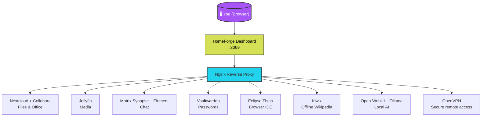
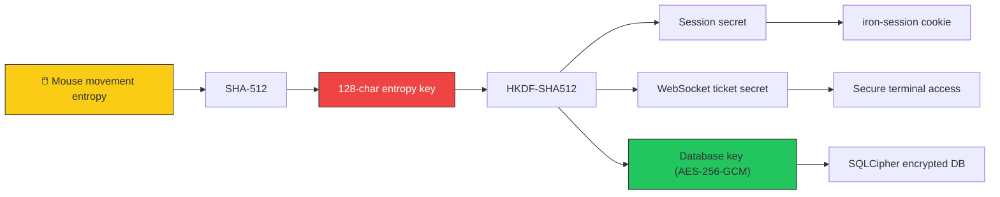
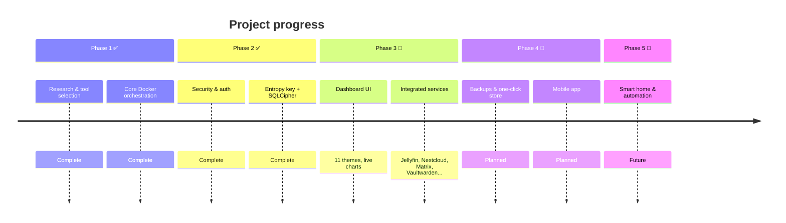

<p align="center">
  <h1 align="center">HomeForge</h1>
  <p align="center"><strong>Your personal, private, self-hosted digital hub.</strong></p>
  <p align="center">One dashboard · One login · Zero cloud dependency</p>
</p>

<p align="center">
  
</p>

---

## The Problem

Google Drive. Office 365. Netflix. 1Password. Chat apps. AI assistants. Every service costs monthly fees, harvests your data, and locks you into ecosystems you do not control.

HomeForge replaces all of that with self-hosted, open-source alternatives running on hardware you own — a Raspberry Pi, an old PC, or a VPS.

Install once. Get a private, encrypted, modular platform that runs your digital life.

---

## Core Principles

| Principle | What it means |
|---|---|
| **Unified** | One login, one dashboard, one update system |
| **Private** | Encryption keys you control, nothing leaves your network |
| **Modular** | Install only what you need, add more later |
| **Simple** | No command line required for day-to-day use |

---

## What's Inside

### Currently Implemented

| Module | What it does | Powered by |
|---|---|---|
| 📁 File & productivity | Documents, calendar, contacts, email | Nextcloud + Collabora |
| 🎬 Media server | Stream video, music, photos | Jellyfin |
| 💻 Code environment | Browser-based IDE with terminal | Eclipse Theia |
| 💬 Communications | Self-hosted encrypted chat | Matrix Synapse + Element |
| 🔑 Password manager | Vault for all credentials | Vaultwarden (Bitwarden-compatible) |
| 🤖 AI assistant | Local LLM chat interface | Open-WebUI + Ollama |
| 📚 Offline knowledge | Wikipedia & more, no internet required | Kiwix |
| 🔒 VPN | Self-hosted private network | OpenVPN |

### Planned Modules

| Module | Powered by |
|---|---|
| ⚡ Workflow automation | n8n |
| 🏠 Smart home | Home Assistant |
| 📝 Version control | Gitea |
| 🌐 Reverse proxy & SSL | Nginx |

---

## Architecture at a Glance



Each service runs in its own Docker container. HomeForge handles networking, shared data volumes, and service health monitoring.

---

## Security Model

HomeForge is encryption-first. The dashboard uses a layered security stack:

### Encryption Flow



### How It Works

**One-time setup wizard** — first launch redirects to `/setup` where mouse movement entropy generates a 128-character hex key. Admin account is created in the same flow.

**HKDF-SHA512 key derivation** — `SESSION_SECRET`, `WS_SECRET`, and `DB_KEY` are all derived from the entropy key at runtime. Never hardcoded. Never stored in `.env`.

**SQLCipher encrypted database** — the SQLite user database is AES-256-GCM encrypted at rest.

**Argon2id password hashing** — 64 MiB memory, 3 iterations. Credentials never stored in plaintext.

**Role-based access** — `admin` and `viewer` roles with middleware guards on all privileged routes.

**Rate limiting** — sliding-window limiter blocks brute force attacks with `X-RateLimit-*` headers.

**WebSocket ticket auth** — terminal access requires a short-lived HMAC-SHA256 ticket that expires after 30 seconds.

> **Unique feature:** The entropy key is derived from your own mouse movements. We never see your key. It never leaves your server.

---

## What's Working (Internal Build)

- ✅ Dashboard with live resource charts (CPU, RAM, disk, network)
- ✅ 11 color themes + glassmorphism UI
- ✅ One-command install on Linux / macOS
- ✅ Security layer: Argon2id, AES-256-GCM, rate-limited auth
- ✅ Multi-user auth with iron-session v8 encrypted cookies
- ✅ All core services integrated and functional
- ✅ Nextcloud Office auto-configured on every container start
- ✅ Entropy key + SQLCipher encrypted database at rest

---

## What's Not Yet Ready

- 📅 Automated backups with test-restore
- 📅 One-click module store
- 📅 Mobile companion app
- 📅 Smart home & workflow automation modules

---

## Roadmap



---

## Quick Start (For When We Go Public)

```bash
chmod +x install.sh
./install.sh
```

One command. Auto-detects your LAN IP. Creates `.env`. Starts all services. Launches your browser.

---

## Get Early Access

We are looking for early testers who run a homelab and want to try the pre‑alpha build.

👉 **[Request early access – fill out this 2-minute form](https://forms.gle/LNhX4XaBUQvshBqHA)**

*(Only email is required. The rest is optional research to help us build what you actually need.)*

---

## Licensing

| Layer | License |
|---|---|
| Core orchestrator | FSL-1.1 / Apache 2.0 |
| Basic app store & UI | Free |
| Premium integrations | Paid tier |

GPL/AGPL tools are available as optional user-deployed modules — not bundled into the core. The paid tier funds ongoing maintenance of complex upstream integrations.

---

## Team

| | |
|---|---|
| **Basil Suhail** · Co-founder & Developer | [LinkedIn](https://linkedin.com/in/basilsuhail) · [GitHub](https://github.com/BasilSuhail) |
| **Saad Shafique** · Co-founder & Developer | [LinkedIn](https://www.linkedin.com/in/saad-shafique-60115934b/) · [GitHub](https://github.com/saadsh15) |

---

<p align="center">
  <strong>HomeForge is pre-release software. No public installation is available yet.</strong><br/>
  <em>Watch this repo for the v0.1.0 beta announcement.</em>
</p>
